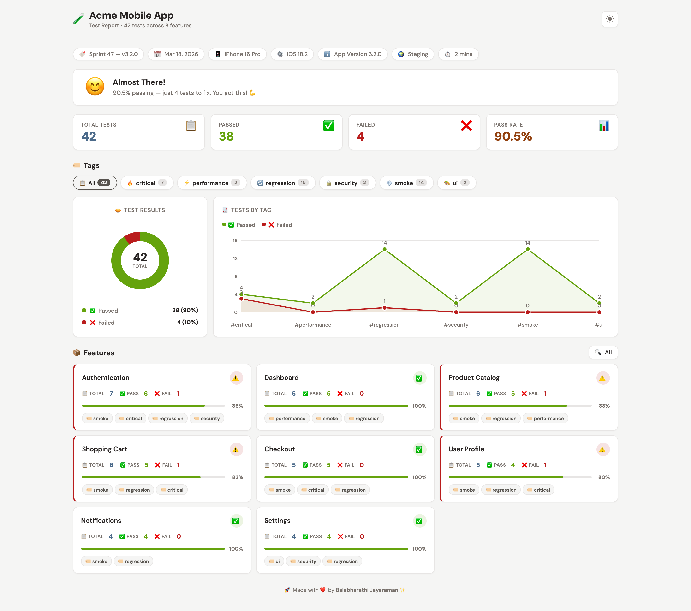
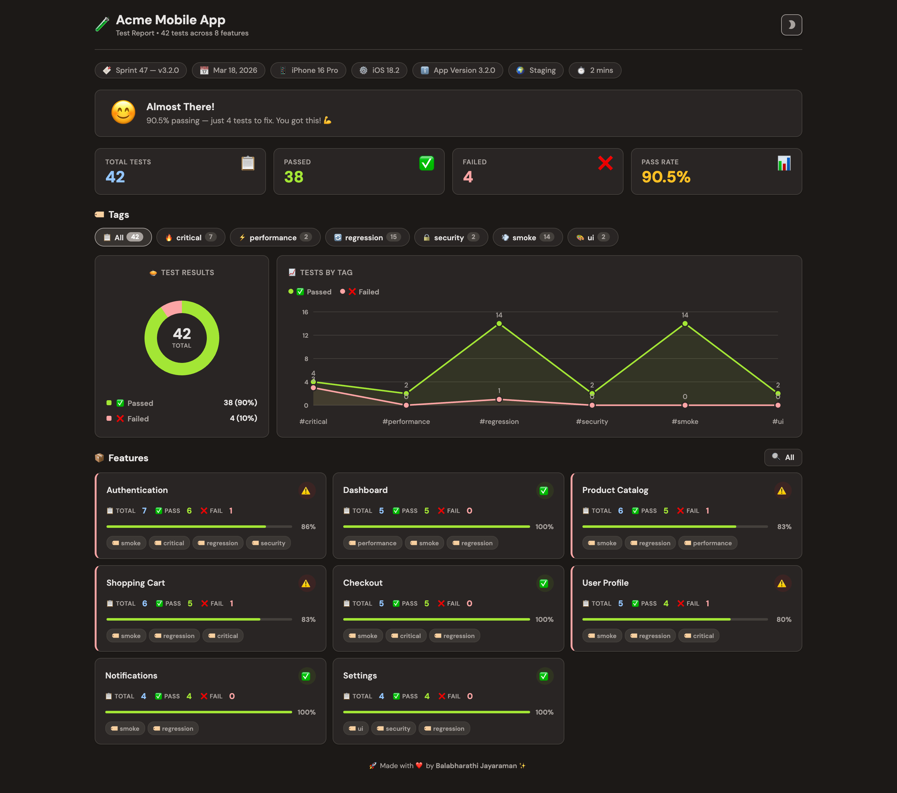

<h1 align="center">
    <a href="https://github.com/balabharathijayaraman/nxgreport">
        
    </a>
    <br> Next Gen Report 💎 <br>
</h1>

<p align="center">
    <a href="#">
        
    </a>
    &nbsp;&nbsp;
    <a href="https://github.com/iambalabharathi/nxgreport/actions/workflows/ci-build-test-publish.yml">
        
    </a>
    &nbsp;&nbsp;
    <a href="#">
        
    </a>
    &nbsp;&nbsp;
    <a href="https://badge.fury.io/rb/nxgreport">
        
    </a>
</p>
<p align="center">Stunning test report in 5 mins ⏳<p>
<h4 align="center">
    A simple light weighted gem to generate a beautiful e-mailable test report. (3500+ Downloads)</h4>
<p align="center">
    Generates a static site (Supports Dark 🌓 mode).
</p>

<p align="center">
  <a href="#demo">Demo</a> •
  <a href="#installation">Installation</a> •
  <a href="#usage">Usage</a> •
  <a href="#license">License</a>
</p>

## **Demo**

<div align="center">
    
    <br/>
    <br/>
    
</div>

## **Installation**

    gem install nxgreport

## **Usage**

```ruby
require 'nxgreport'

$NxgReport.setup(location: "Absolute file path", title: "My Report")

$NxgReport.set_device(name: "iPhone X")
$NxgReport.set_os(name: "iOS 12.1")
$NxgReport.set_release(name: "M09 2020")
$NxgReport.set_app_version(no: "app0.9.1")
$NxgReport.set_environment(name: "QA")

$NxgReport.log_test(
        feature_name: "Feature Name",
        test_name: "This is a test",
        test_status: "Pass/Fail",
        comments: "Error message or additional comments about the test",
        tag: "critical")

$NxgReport.build()
```

## **Cucumber-Ruby Usage**

In `env.rb` add the below line

```ruby
require 'nxgreport'

$NxgReport.setup(location: "Absolute file path", title: "My Report")

$NxgReport.set_device(name: "iPhone X")
$NxgReport.set_os(name: "iOS 12.1")
$NxgReport.set_release(name: "M09 2020")
$NxgReport.set_app_version(no: "app0.9.1")
$NxgReport.set_environment(name: "QA")
```

In `hooks.rb` add the below block of code.

```ruby
After do |scenario|

    feature_name = scenario.feature.name
    scenario_status = !scenario.failed?() ? "Pass" : "Fail"
    comments = (scenario.exception.nil?) ? "Success" : scenario.exception.message

    $NxgReport.log_test(
            feature_name: feature_name,
            test_name: scenario.name,
            test_status: scenario_status,
            comments: comments,
            tag: "critical")
end

at_exit do
    $NxgReport.build()
end
```

## **Parameters Explaination**

```ruby
$NxgReport.setup(location, title)
```

- `location` - _File path - C:\Report\index.hmtl_
- `title` - _String_

```ruby
$NxgReport.log_test(
        feature_name: "Login",
        test_name: "Login with email address and password",
        test_status: "Pass",
        comments: "System failure",
        tag: "Critical")
```

- `feature_name` - _String_
- `test_name` - _String_
- `test_status` - _Pass or Fail_
- `comments` - _Sring_
- `tag` - _Sring_

## **Like it?**

<a href="https://www.buymeacoffee.com/iambalabharathi" target="_blank"></a>

## **Contributing**

I'm open to any contribution. It has to be tested properly though.

## **License**

Copyright © 2020 [MIT License](LICENSE)
