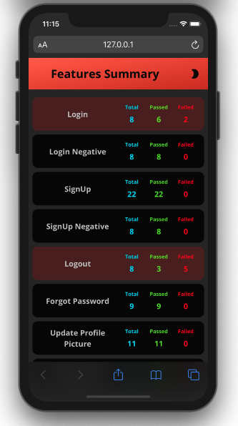
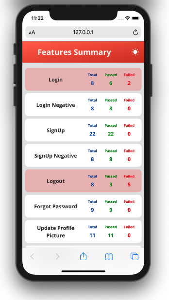

<h1 align="center">
    <a href="https://github.com/balabharathijayaraman/nxgreport">
        
    </a>
    <br> Next Gen Report 💎 <br>
</h1>

<p align="center">
    <a href="https://badge.fury.io/rb/nxgreport">
        
    </a>
    &nbsp;&nbsp;
    <a href="https://badge.fury.io/rb/nxgreport">
        
    </a>
    <!-- <a href="#">
        
    </a> -->
    &nbsp;&nbsp;
    <a href="https://badge.fury.io/rb/nxgreport">
        
    </a>
</p>

<h4 align="center">A simple light weighted gem to generate a beautiful e-mailable test report.</h4>
<p align="center">
It displays a single view where tests (total, pass, fail) are grouped by functionality. The result is a single static HTML file with an option to switch between dark & light modes.
</p>

<p align="center">
  <a href="#demo">Demo</a> •
  <a href="#installation">Installation</a> •
  <a href="#usage">Usage</a> •
  <a href="#license">License</a>
</p>

## **Demo**

<div align="center">
     
    
    <br>
    <br>
     
    
</div>

## **Installation**

    gem install nxgreport

## **Usage**

```
require 'nxgreport'

$NxgReport.setup(location: "Absolute file path", title: "My Report")

$NxgReport.set_execution(date: "10-10-2020")
$NxgReport.set_device(name: "iPhone X")
$NxgReport.set_os(name: "iOS 12.1")
$NxgReport.set_release(name: "M09 2020")
$NxgReport.set_app_version(no: "app0.9.1")
$NxgReport.set_environment(name: "QA")

$NxgReport.log_test(feature_name: "Feature Name", test_status: "Pass/Fail")

$NxgReport.build()
```

## **Cucumber Ruby Usage**

In **env.rb** add the below line

```
require 'nxgreport'

$NxgReport.setup(location: "Absolute file path", title: "My Report")

$NxgReport.set_execution(date: "10-10-2020")
$NxgReport.set_device(name: "iPhone X")
$NxgReport.set_os(name: "iOS 12.1")
$NxgReport.set_release(name: "M09 2020")
$NxgReport.set_app_version(no: "app0.9.1")
$NxgReport.set_environment(name: "QA")
```

In **hooks.rb** add the below block of code.

```
After do |scenario|
    feature_name = scenario.feature.name
    scenario_pass = !scenario.is_failed?() ? "Pass" : "Fail"
    $NxgReport.log_test(feature_name: "Feature Name", test_status: scenario_pass)
end

at_exit do
    $NxgReport.build()
end
```

## **Parameters Explaination**

```
$NxgReport.setup(location, title)
```

- **location (optional):** _This is an absolute path where the report should be generated (ex: "C:\Report\index.hmtl). If not passed, the report will be generated in the **root folder** as **NxgReport.html**_
- **title (optional):** _This is title of report displayed. If not passed, the report will be generated with a title "Features Summary"_

```
$NxgReport.log_test("Feature Name", "Pass/Fail")
```

- **feature_name** _This is the feature name under the test should be logged ex:(Login with Biometrics)_
- **test_status** _This is the status of the test, allowed values are Pass or Fail_

## **Contributing**

We're open to any contribution. It has to be tested properly though.

## **License**

Copyright © 2020 [MIT License](LICENSE)

## **Like it ?**

Hit that star icon -> ✭ at the top right corner of this page to show you appreciation, it will be huge boost for me to improve & add new features on this project.
