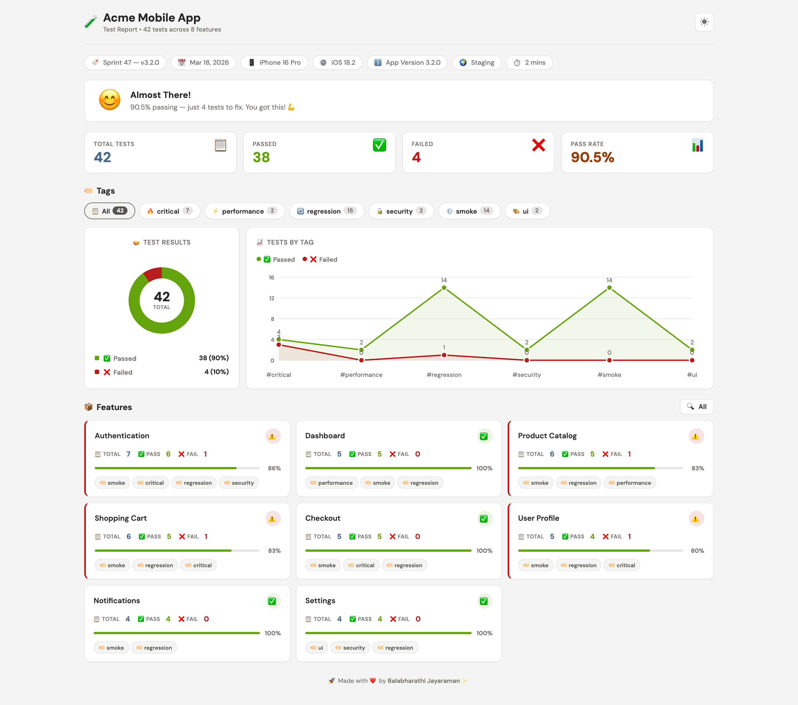
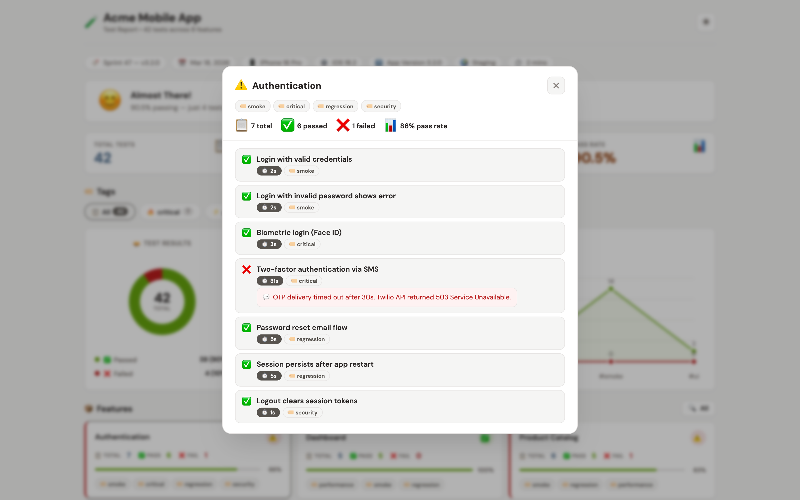
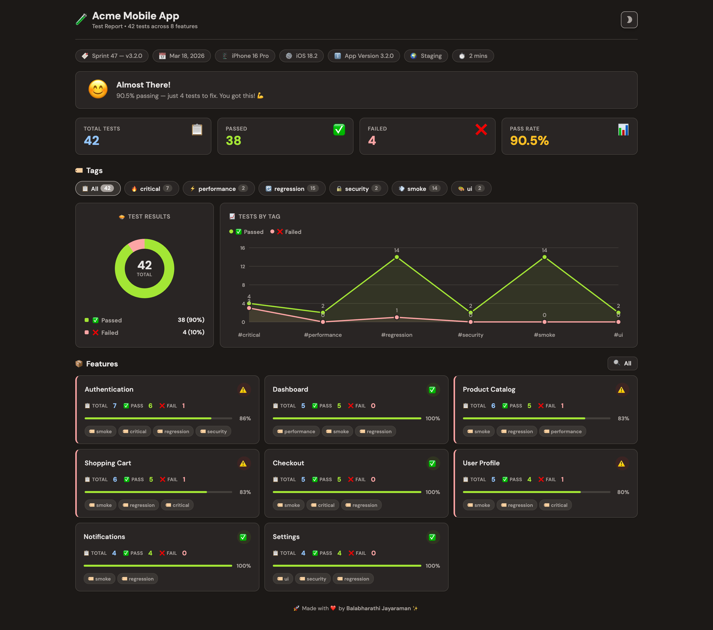
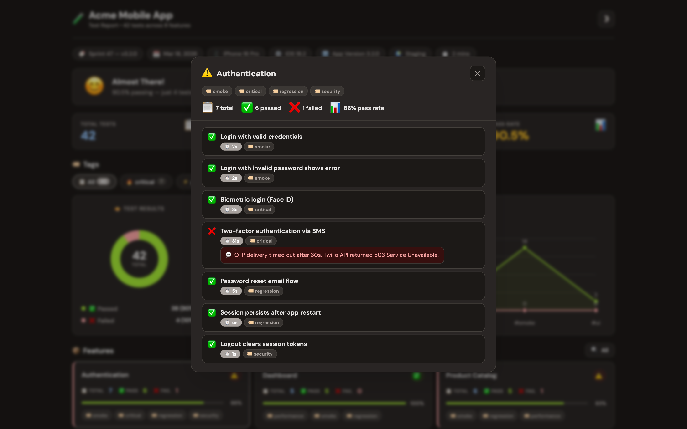

<div align="center">
  
  <h1>NxgReport</h1>
  <p><strong>Beautiful, zero-dependency test reports for Ruby</strong></p>
  <p>Generate stunning, self-contained HTML test reports that you can share, email, or host anywhere.<br/>No server required — just a single <code>.html</code> file.</p>

  <a href="https://badge.fury.io/rb/nxgreport"></a>&nbsp;
  <a href="https://github.com/iambalabharathi/nxgreport/actions/workflows/ci-build-test-publish.yml"></a>&nbsp;
  <a href="https://github.com/iambalabharathi/nxgreport/blob/main/LICENSE"></a>&nbsp;
  

  <br/><br/>

  <a href="#-screenshots">Screenshots</a>&nbsp;&nbsp;&bull;&nbsp;&nbsp;<a href="#-quick-start">Quick Start</a>&nbsp;&nbsp;&bull;&nbsp;&nbsp;<a href="#-features">Features</a>&nbsp;&nbsp;&bull;&nbsp;&nbsp;<a href="#-api-reference">API</a>&nbsp;&nbsp;&bull;&nbsp;&nbsp;<a href="#-cucumber-integration">Cucumber</a>&nbsp;&nbsp;&bull;&nbsp;&nbsp;<a href="#-contributing">Contributing</a>
</div>

<br/>

## Screenshots

<div align="center">
  <h4>Light Mode</h4>
  
  <br/><br/>
  
  <br/><br/>
  <h4>Dark Mode</h4>
  
  <br/><br/>
  
</div>

<br/>

## Features

| | |
|---|---|
| **Self-contained HTML** | Single `.html` file with all CSS & JS inlined — no external dependencies at runtime |
| **Light & Dark mode** | Auto-detects system preference, with a manual toggle |
| **Interactive dashboard** | Health banner, stat cards, pass-rate progress bars, and feature cards |
| **Charts** | Donut chart for pass/fail breakdown, line chart for tests by tag |
| **Tag filtering** | Tag your tests (`smoke`, `critical`, `regression`, etc.) and filter interactively |
| **Test detail modal** | Click any feature card to see individual test results, execution times, and error messages |
| **Metadata bar** | Display release name, device, OS, app version, environment, and execution time |
| **E-mailable** | Works in any browser — share via email, Slack, or host as a static page |
| **Zero dependencies** | Pure Ruby gem with no runtime dependencies |

<br/>

## Quick Start

### Install

```bash
gem install nxgreport
```

Or add to your `Gemfile`:

```ruby
gem 'nxgreport'
```

### Generate a report

```ruby
require 'nxgreport'

# Configure
$NxgReport.setup(location: "./TestReport.html", title: "My Test Suite")
$NxgReport.set_device(name: "iPhone 16 Pro")
$NxgReport.set_os(name: "iOS 18.2")
$NxgReport.set_release(name: "Sprint 47")
$NxgReport.set_app_version(no: "3.2.0")
$NxgReport.set_environment(name: "Staging")

# Log tests
$NxgReport.log_test(
  feature_name: "Login",
  test_name: "User can login with valid credentials",
  test_status: "Pass",
  comments: "Success",
  tag: "smoke",
  execution_time: 3.2
)

$NxgReport.log_test(
  feature_name: "Login",
  test_name: "Biometric authentication",
  test_status: "Fail",
  comments: "TouchID prompt not displayed on simulator",
  tag: "critical",
  execution_time: 5.4
)

# Build the report
$NxgReport.build()
```

That's it — open the generated `.html` file in any browser.

<br/>

## API Reference

### Setup

| Method | Description |
|--------|-------------|
| `$NxgReport.setup(location:, title:)` | Set the output file path and report title |
| `$NxgReport.set_device(name:)` | Device under test (e.g. `"iPhone 16 Pro"`) |
| `$NxgReport.set_os(name:)` | OS version (e.g. `"iOS 18.2"`) |
| `$NxgReport.set_release(name:)` | Release or sprint name |
| `$NxgReport.set_app_version(no:)` | Application version number |
| `$NxgReport.set_environment(name:)` | Test environment (e.g. `"Staging"`, `"QA"`) |
| `$NxgReport.set_execution(date:)` | Custom execution date (defaults to today) |
| `$NxgReport.open_upon_execution(value:)` | Auto-open report in browser after build |

### Logging tests

```ruby
$NxgReport.log_test(
  feature_name: "Feature Name",    # Required — groups tests under a feature card
  test_name: "Test description",   # Required — name of the individual test
  test_status: "Pass",             # Required — "Pass" or "Fail"
  comments: "Error details",       # Optional — shown in the detail modal
  tag: "smoke",                    # Optional — used for tag filtering & charts
  execution_time: 3.2              # Optional — in seconds (auto-calculated if omitted)
)
```

### Building

```ruby
$NxgReport.build()  # Generates the HTML report file
```

<br/>

## Cucumber Integration

**`env.rb`** — setup the report:

```ruby
require 'nxgreport'

$NxgReport.setup(location: "./reports/CucumberReport.html", title: "Cucumber Results")
$NxgReport.set_device(name: "iPhone 16 Pro")
$NxgReport.set_os(name: "iOS 18.2")
$NxgReport.set_environment(name: "QA")
```

**`hooks.rb`** — log each scenario automatically:

```ruby
After do |scenario|
  $NxgReport.log_test(
    feature_name: scenario.feature.name,
    test_name: scenario.name,
    test_status: scenario.failed? ? "Fail" : "Pass",
    comments: scenario.exception&.message || "Success",
    tag: "cucumber"
  )
end

at_exit do
  $NxgReport.build()
end
```

<br/>

## Contributing

Contributions are welcome! Feel free to open an issue or submit a pull request.

1. Fork the repository
2. Create your feature branch (`git checkout -b my-feature`)
3. Commit your changes (`git commit -m 'Add my feature'`)
4. Push to the branch (`git push origin my-feature`)
5. Open a Pull Request

<br/>

## Support the project

If you find NxgReport useful, consider supporting its development:

<a href="https://www.buymeacoffee.com/iambalabharathi" target="_blank"></a>

<br/>

## License

MIT &copy; [Balabharathi Jayaraman](https://www.linkedin.com/in/iambalabharathi)
